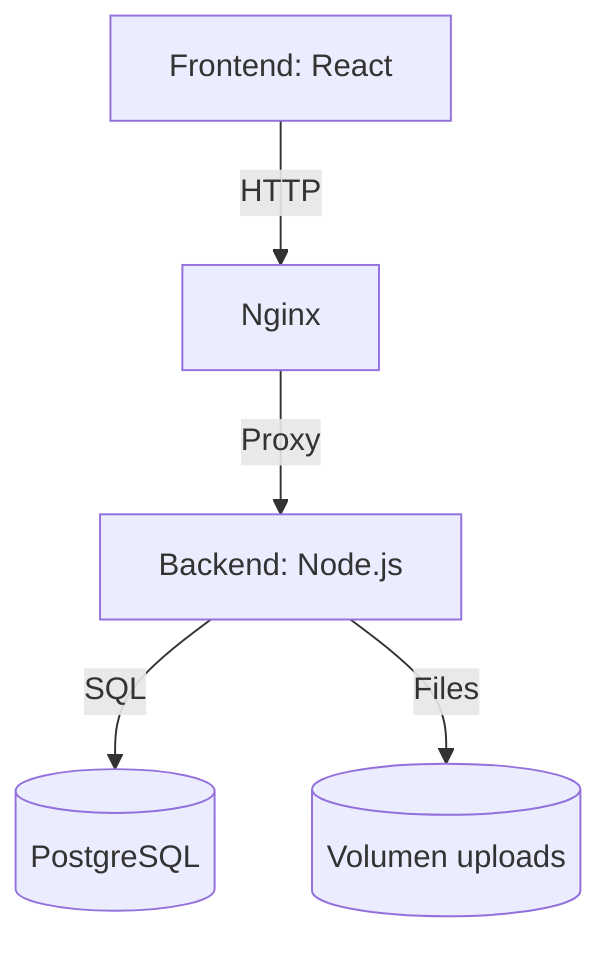

# Sistema CMPC - Documentación


---

## Instalación

### Requisitos Mínimos
- Docker 20.10+
- Docker Compose 2.0+
- 2GB RAM mínimo
- 5GB de espacio en disco

### Pasos Rápidos

git clone https://github.com/tu-repositorio/CMPC.git
- cd CMPC
- docker-compose up -d --build





```
CMPC/
├── backend/            # Backend Node.js + Express
│   ├── src/            # Controladores, rutas y modelos
│   ├── Dockerfile      # Configuración para producción
│   └── package.json    # Dependencias y scripts
├── frontend/           # Frontend React
│   ├── public/         # Íconos, index.html
│   ├── src/            # Componentes y páginas
│   └── Dockerfile      # Configuración multi-stage
├── docker-compose.yml  # Servicios: app, db, nginx
└── README.md           # Esta documentación
```

> **Nota**: Esta estructura sigue el estándar para aplicaciones Dockerizadas con frontend y backend separados.

